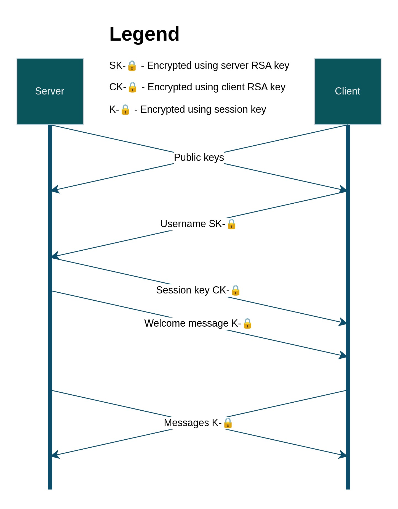
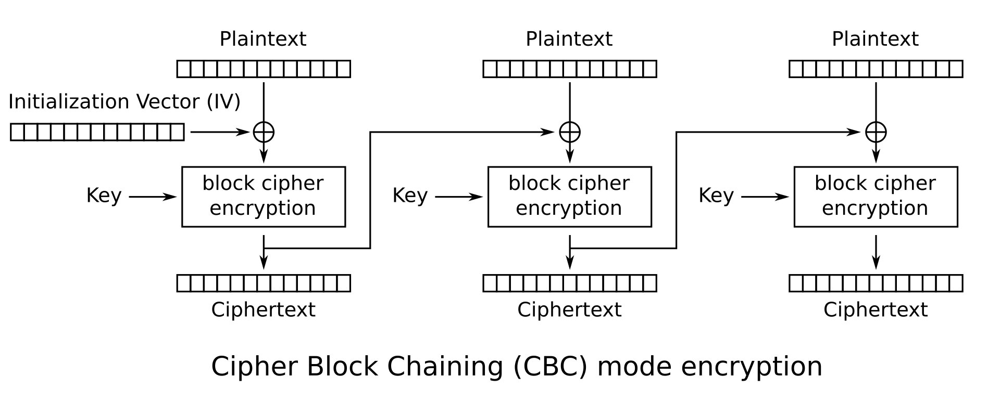

# Chat application with RSA and AES encryption
Lab assignment for Discrete math course.

The main goal of the lab assignment:
- Chat application
- Rivest-Shamir-Adleman encryption (RSA) and key exchange

Additional:
- Advanced Encryption Standard symmetric encryption (AES)

### Task distribution
- Andrii Kryvyi: Chat protocol and AES encryption/decryption
- Anastasiia Lubenchuk: RSA encryption/decryption

## Protocol description
### Connection layer
The core of the protocol is the entity called message and chunk. A message is just a sequence of bytes with arbitrary length. Class Connection is responsible for sending the message.

Message is divided into chunks each of size from 1 to 32767 bytes included.

Each chunk consists of a header and body. The header is 2 bytes long and the body has an arbitrary length. The first bit of the header is a flag, which signals whether the chunk is last (if 1, then this is the last chunk of the message), and the other 15 bits represent the length of the body (from 1 to 32767).

Each chunk is sent through a TCP connection. Also, there is a locking mechanism to provide thread safety for clients to avoid sending chunks from different messages simultaneously.

### Session layer
The session class is built over the connection class (in the way of composition). When sending/receiving messages through the session layer, it encrypts the data using the AES encryption key and decrypts using the AES decryption key.

Two different keys are used (though at the start they are the same and the actual key remains the same) to synchronize Initialization vector (IV) when simultaneously sending and receiving.

Before sending the message, the session also hashes it using SHA256 and attaches the hash value (32 bytes) to the end of the message. When receiving, the session checks the hash and raises an error if a mismatch happens (the message has been changed).

### Initial handshake

After the connection is established, the client and server send their respective RSA public keys as messages through the Connection.

After receiving the public key, the client encrypts its username using it and sends it through the Connection. When receiving the username the server validates it and closes the connection if it is invalid.

After that server generates the AES key (session key, which is unique per-user), encrypts it with the RSA, and sends it through the Connection.

Not waiting, the server sends an encrypted welcome message through the Session object. Then the message exchange is established through the Session.

### Message exchange
When the user types in a message, the client sends it directly through the Session. When the server receives it, it adds a prefix with a username to the message and broadcasts it to other connected clients through their Session objects.

## Command-line interface (CLI)
The command-line interface is very simple, when connecting or creating a server, there are prompts to specify the username/chatname and address of the server. You can omit the server address, in that case, it uses `localhost:9000`.

To exit from the client or the server type `:q`, to enter a message that starts with :, type `::message` (will be sent as `:message`)

Also, you can broadcast messages to all clients using server CLI (just type in the message)

## Encryption and decryption

### RSA-1024
We use RSA asymmetric encryption for exchanging usernames and session keys. The default version uses a 1024-bit key, which is not very secure (but fast), you can change it in the `server.py` and `client.py`.

For generating keys we use **Fermat's primality test** with the specified number of iterations (default is 16, but you, again, can change it in the `server.py` and `client.py`) and `secrets` for generating securely random numbers.

Message and cipher are treated as large numbers in MSB first byte order.

> [!NOTE]
> No padding is applied, which may lead to security issues.

### AES-256
We use AES symmetric encryption for messages, in particular the 256-bit version (yet you can change it in the `server.py`) in Cipher block chaining mode (CBC).

There are a lot of resources on how AES encrypts single blocks, you can check the code at `/crypto/aes/block.py`. When talking about mode, we simply XOR the current block with the cipher of the previous one (or IV if it is the first block).

IV is generated randomly in couple with the key using the Python `secrets` module for secure random values.

The message to be encrypted is broken into blocks of size 16 bytes. We use padding according to PKCS#7 (adding bytes whose value is the length of the padding, if the length of the message is divisible by 16, then we add a block filled with `0x10` value).
